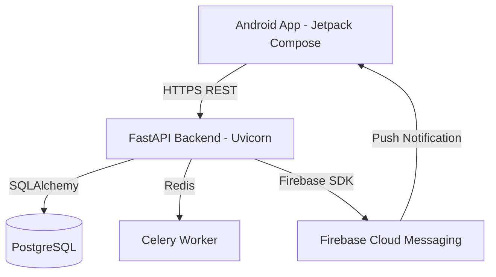

# CAMS Enterprise
## 02. System Architecture

### Frontend Architecture
The Android application follows the **MVVM (Model-View-ViewModel)** architectural pattern.
- **View (Jetpack Compose):** Declarative UI components that observe state from ViewModels.
- **ViewModel:** Manages UI state, handles user interactions, and acts as the bridge to repositories. Uses Kotlin Coroutines for async tasks.
- **Repository Pattern:** Abstracts data sources. Fetches from Retrofit API and caches locally using Room Database (where applicable).

### Backend Architecture
Built with **FastAPI**, the backend uses a robust layered architecture.
- **Routers (`endpoints/`):** Defines API contracts, validates request schemas using Pydantic, and routes to appropriate services.
- **Services (`services/`):** Contains the core business rules and logic. Decoupled from HTTP context.
- **Repositories (`db/repositories/`):** Performs CRUD operations using SQLAlchemy ORM.
- **Models (`db/models/`):** Defines SQLAlchemy Entities mapping directly to PostgreSQL tables.

### Database Architecture
PostgreSQL is utilized as the single source of truth. Schema integrity is maintained strictly by Alembic migrations, eliminating runtime table creation errors.

### Authentication & Security Flow
1. User submits credentials (email/password).
2. Backend validates against hashed passwords in DB.
3. Backend issues an access JWT containing user `sub` and `role`.
4. Client stores JWT securely and passes it via `Authorization: Bearer <token>`.
5. Backend middleware decodes token and verifies role permissions before executing business logic.

### Application Lifecycle
- **Mobile:** Bound to standard Android Component Lifecycles.
- **Backend:** Runs as a continuous ASGI service managed by Uvicorn, with background tasks offloaded to Celery workers.

### Complete Architecture Diagrams

